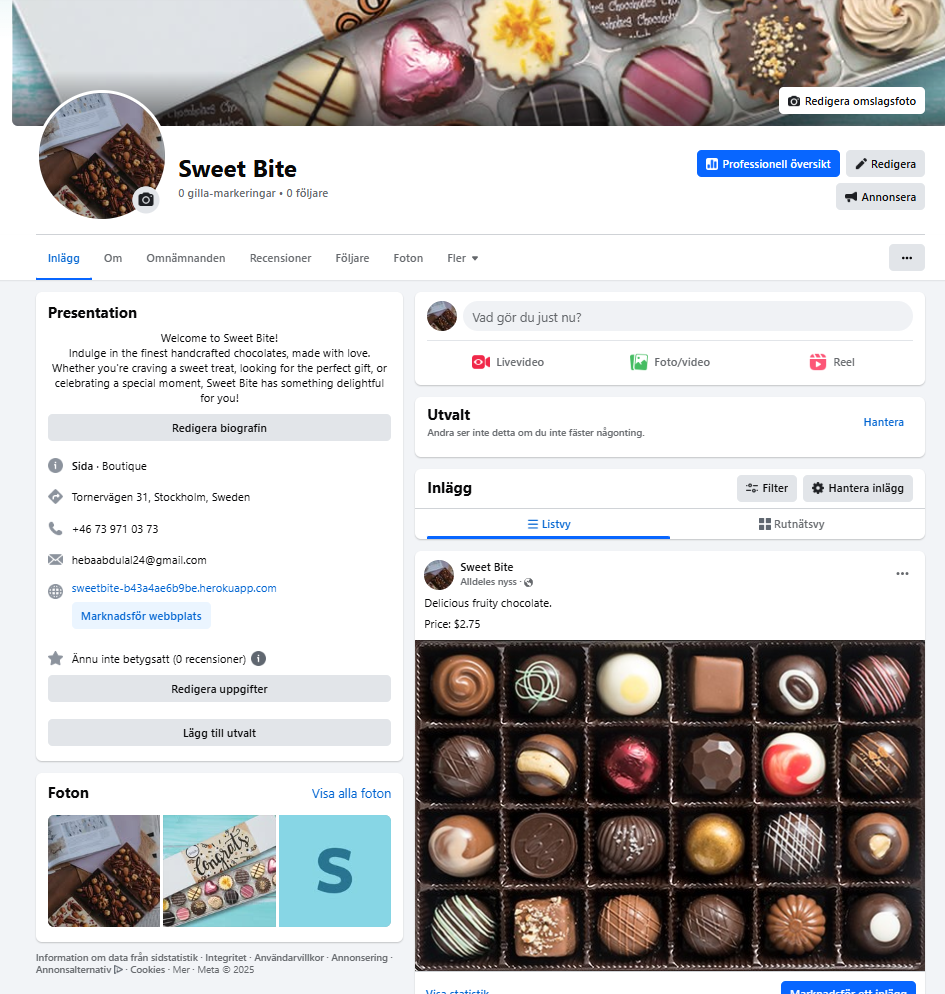
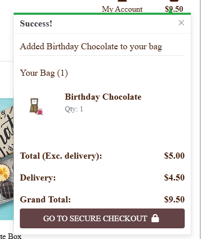

# Sweet Bite - Chocolate shop eCommerce Website

Sweet Bite Chocolate Shop is a fully-functional B2C eCommerce platform dedicated to chocolate lovers. We offer customers the convenience of browsing, purchasing, and reviewing our premium chocolate collections online. Whether you're seeking a thoughtful gift, indulging your sweet tooth, or exploring new chocolate flavors, SweetBite delivers a user-friendly and immersive experience for everyone.

The site was built using HTML, CSS, JavaScript/jQuery, and Python (powered by the Django Framework).

The Live Site can be found [Here](https://sweetbite-b43a4ae6b9be.herokuapp.com/)

## User Experience (UX)
1. Design:

Clean, visually appealing, and intuitive interface.
Minimalistic design focusing on food and/or product visuals (use high-quality images).
Easy navigation with a simple and responsive menu bar.
2. Functionality:

Quick Load Times: Optimize for speed to reduce bounce rates.
Search Functionality: Implement an advanced search bar with filters (e.g., product type, dietary preferences).
Personalization: Tailored recommendations based on past purchases or user behavior.
Mobile Optimization: Ensure a seamless mobile experience since most users may browse on-the-go.
3. Accessibility:

WCAG-compliant design for users with disabilities.
Voice navigation or easy accessibility options for visually impaired users.
4. Feedback & Support:

Offer easy-to-access customer support (live chat, FAQ, or a dedicated help page).
Provide a feedback loop to collect user suggestions for continuous improvement.

### Site User Goals

- For New Visitors:

Discover and explore the range of offerings.
Understand the unique value proposition (e.g., fresh ingredients, gourmet preparation, fast delivery).
Easy sign-up or account creation.

- For Returning Users:

Quickly reorder past purchases or favorites.
Access exclusive offers, rewards, or loyalty points.
Find personalized recommendations based on previous interactions.

- Common Goals:

Seamless checkout process (guest checkout option for new users).
Secure payment processing.
Stay updated with new offers or menu additions.

### Returning User Experience (UX)

- Personalization:

Greet users by name.
Provide a "Recently Viewed" or "Favorites" section.
Highlight special deals or discounts based on purchase history.

- Simplified Navigation:

Enable one-click reordering for past purchases.
Offer a dashboard for managing subscriptions, orders, and preferences.

- Loyalty Features:

Points-based loyalty system (e.g., earn points for every dollar spent).
Display progress towards rewards (e.g., “5 more purchases to unlock free delivery”).

- Engagement:

Notify users about limited-time offers or product restocks.
Allow for user reviews and social sharing to foster community engagement.

## Business Model and Website Overview
Sweetbite operates on the Business-to-Consumer (B2C) model, specializing in premium handmade chocolates, truffles, pralines, chocolate bars, and curated gift boxes. The primary target market includes individuals such as families, event organizers, chocolate enthusiasts, and gifting consumers who seek high-quality, customizable chocolate treats delivered directly to their doorsteps.

The Sweetbite website is the brand’s primary platform, designed to provide a seamless shopping experience. Customers can browse, order, and personalize their chocolate selections with ease. The website incorporates user-friendly features such as:

Product Filters: Options to filter by category, rating dietary preferences and price.
Secure Payment Options: A smooth, safe checkout process supporting multiple payment methods to ensure customer convenience.

## Marketing Strategy
To ensure the success and visibility of Sweet Bite, we implement a strategic marketing approach that enhances brand awareness, attracts customers, and drives sales.

- Brand Positioning
We position Sweet Bite as a premium online chocolate shop offering:

High-quality, handcrafted chocolates made from the finest ingredients.
Unique flavors and gift options for every occasion.
A seamless online shopping experience.

- Content Marketing
We create engaging content to attract and educate chocolate lovers:

Social media content including behind-the-scenes photos, and customer testimonials.
Email newsletters with exclusive offers, new product launches, and seasonal collections.

- Social Media & Community Engagement
We build an active and engaged community on:

Facebook: Customer engagement, promotions, and updates.

- SEO & Online Visibility
To ensure Sweet Bite ranks high on search engines, we optimize:

Product descriptions with relevant keywords.
Website speed & mobile-friendliness for better user experience.
Google My Business & local SEO for regional visibility.

I used an online tool WordStream to help locate keywords to use for my site. There was a mixture of a high and low competition so I used a selection of all that appeared in the results.
Keywords were then added into the meta tags of the base.html file

- Customer Experience
Encouraging customer reviews.

## Agile methodolgy

Before I began coding my project, I set up an Issues template in GitHub and linked it with a board for user stories. In addition, labels and milestones were created ensure my project work was planned accordingly based on the time I had to finish and submit the work.

User stories were added to sprints to allow me to focus on sections of work at a particular time. Allowing me to work out a good pace to complete work.

As things occurred during the project, other items would be introduced and re-prioritised, enforcing the agile methodology of working.

### User Stories & Epics

To effectively plan the project's development, I created user stories and assigned them to specific sprints. This ensured tasks were tackled at the right time, allowing for a structured workflow leading up to the submission deadline.

Each user story was linked to a milestone, enabling a detailed breakdown of tasks within their respective EPIC categories.

EPICS:

- User Authentication and Basic Functionality
    - [User Story 12](https://github.com/HebaAbdulal/Chocolate-shop/issues/12)

- Deployment Readiness
    - [User Story 25](https://github.com/HebaAbdulal/Chocolate-shop/issues/25)
    - [User Story 26](https://github.com/HebaAbdulal/Chocolate-shop/issues/26)

- Wishlist and Promotional Features
    - [User Story 15](https://github.com/HebaAbdulal/Chocolate-shop/issues/15)
    - [User Story 17](https://github.com/HebaAbdulal/Chocolate-shop/issues/17)
    - [User Story 18](https://github.com/HebaAbdulal/Chocolate-shop/issues/18)
    - [User Story 14](https://github.com/HebaAbdulal/Chocolate-shop/issues/14)

- Product Ratings
    - [User Story 21](https://github.com/HebaAbdulal/Chocolate-shop/issues/21)

- Order Management and User Notifications
    - [User Story 27](https://github.com/HebaAbdulal/Chocolate-shop/issues/27)
    - [user Story 11](https://github.com/HebaAbdulal/Chocolate-shop/issues/11)

- Admin Dashboard and Management
    - [User Story 13](https://github.com/HebaAbdulal/Chocolate-shop/issues/13)

- Shopping Cart and Checkout Process
    - [User Story 10](https://github.com/HebaAbdulal/Chocolate-shop/issues/10)
    - [User Story 8](https://github.com/HebaAbdulal/Chocolate-shop/issues/8)
    - [User Story 9](https://github.com/HebaAbdulal/Chocolate-shop/issues/9)
    - [User Story 6](https://github.com/HebaAbdulal/Chocolate-shop/issues/6)

- User Authentication and Basic Functionality
    - [User Story 3](https://github.com/HebaAbdulal/Chocolate-shop/issues/3)
    - [User Story 2](https://github.com/HebaAbdulal/Chocolate-shop/issues/2)
    - [User Story 1](https://github.com/HebaAbdulal/Chocolate-shop/issues/1)

- Product Catalog and Browsing
    - [User Story 7](https://github.com/HebaAbdulal/Chocolate-shop/issues/7)
    - [User Story 4](https://github.com/HebaAbdulal/Chocolate-shop/issues/4)
    - [User Story 5](https://github.com/HebaAbdulal/Chocolate-shop/issues/5)
    - [User Story 16](https://github.com/HebaAbdulal/Chocolate-shop/issues/16)

## Site Design

The initial design was influenced by the Code Institute Boutique Ado walkthrough; however, I incorporated various styling modifications to enhance both the UI and UX, making it unique. The navigation bar and footer are consistently displayed across all pages, along with the search bar. A uniform color scheme, buttons, text styling, and shadow boxes ensure a cohesive look and feel.

Sweet Bite offers a visually appealing experience with a clean white background complemented by rich dark brown accents. The integration of Font Awesome icons throughout the site further enhances the user experience by adding engaging visual elements.

### Wireframes

I designed wireframes to outline the layout and structure of various pages, helping to visualize their appearance and functionality. Additionally, I planned the URL setup in advance to ensure a well-organized site structure before beginning the coding process.

- Home page wireframe

- Products page wireframe

- Product detail wireframe

- Product management wireframe

### Database Scheme

An entity relationship diagram was designed using [DBdiagram](https://dbdiagram.io/d/66a404f48b4bb5230e7997fd) to illustrate the structure of each model and their relationships within the database.

## Features

### Navbar
The navigation bar is present on all pages, ensuring seamless access and easy navigation throughout the site. It features dropdown menus that group related items into sections, helping users find what they need more efficiently.

For tablets and mobile devices, the navigation bar collapses into a more compact format, including a dedicated home link. On larger screens, the site's logo serves as the home button, directing users back to the homepage.

### Search bar
The search bar is integrated into the navigation bar, enabling users to search for keywords within product names or descriptions.
If nothing is found based off of their search, the user can see no results

### Homepage/ Subsicriptions
The homepage provides visitors with an overview of the site, making sure they understand its purpose right away.

It also includes a sign-up section where visitors can enter their email to receive updates and special offers from the store.

### All Products
The "All Products" view displays a list of all available items in the store. Each product includes its image, price, category, and rating, allowing users to review the details before making a selection. Additionally, users have the option to add products to their wishlist for future reference.

The "All Products" dropdown in the navigation menu provides additional options for customers to browse the product list in different ways.

Besides the "All Products" dropdown in the navigation menu, additional sorting options are available on the product list, allowing customers to browse products in different orders for a more tailored shopping experience.

### Indiviual product view
- Detailed Product Pages – Each product has a dedicated page with images, descriptions and price.
- Product Ratings – Users can view ratings and reviews left by other customers.
- Add to Cart & Wishlist – Users can add products to their shopping bag or save them to their wishlist for later.

### Shopping Bag & Wishlist
- Shopping Bag – A user-friendly cart allowing customers to review and adjust their order before checkout.

- Wishlist – Users can save favorite items for future purchases, making it easy to track desired products.

### Promotions
Seasonal Promotions – Limited-time sales on featured products.

### Checkout & Payment
- Secure Checkout Process – Users can enter delivery details and make secure payments.
- Order Summary – A clear breakdown of the total cost, including delivery fees.
- Payment Gateway Integration – Supports multiple payment methods, including credit/debit cards and online payment services.

### User Profiles & Order History
- User Dashboard – Registered users can update their profile details and manage their orders.
- Order History – Track past purchases, view order details, and reorder favorite items.

### Delivery Information & Tracking
- Shipping Details – Clear delivery policies and estimated arrival times.

- Order Status Updates – Customers receive email notifications on order processing and shipping.

### Product Management (Admin Panel)
- Add & Edit Products – Admins can easily add new chocolates, update descriptions, and adjust prices.

- Manage Orders – View and process customer orders efficiently.

### Custom Error Pages
403 Forbidden – For unauthorized access attempts.
404 Not Found – Custom page for missing content.

500 Internal Server Error – A user-friendly message when unexpected errors occur.

### Messages

Toast messages are displayed across the site to enhance user experience by providing real-time feedback on various actions, as highlighted in other feature sections. These notifications inform users about key events, such as adding items to their bag, logging in or out, receiving order confirmation numbers, entering incorrect search criteria, or completing specific actions.

To improve clarity, these messages are color-coded based on their type, ensuring users can quickly distinguish between success, errors, and other alerts.

### Login/ Logout/ Sign up

The login, logout, and signup pages, along with other AllAuth templates, have been customized to seamlessly match the overall design of the Sweet Bite website.

Users can effortlessly sign up, verify their email addresses, and request password resets, ensuring a smooth and consistent experience throughout the site.

### Color Scheme

This color scheme conveys elegance, sophistication, and a warm, inviting atmosphere, likely inspired by chocolate or coffee themes. The combination of dark tones with white highlights ensures good contrast and visual appeal.

### Site Security

To enhance security, decorators like @login_required and HttpResponseForbidden were implemented in views to restrict access to certain pages and actions. This prevents unauthorized users from accessing protected content, even if they manipulate URL paths or bypass other security measures.

With these safeguards in place, users attempting to access restricted areas will be shown appropriate messages or redirected to the 403 Forbidden error page.

Example: If a user tries to add a product by entering the correct URL manually, the system will block the action and show an appropriate message, ensuring they cannot perform unauthorized modifications.

## Testing

Site testing can be found in [TESTING.md](https://github.com/HebaAbdulal/Chocolate-shop/TESTING.md)

### Mobile and Tablet

Screenshots of responsive design can be found in the [TESTING.md](https://github.com/HebaAbdulal/Chocolate-shop/TESTING.md)

### Features for future consideration

I was able to implement most of the features I initially planned for the website.

In the future, I’d like to introduce a collection option at checkout. This would let users opt out of delivery by selecting a checkbox, removing the need for delivery details, and allowing them to pick up their items directly from the store.

Additionally, I want to implement full CRUD functionality for all store options. This would enable the store owner to manage inquiries and other tasks directly from the front end, streamlining operations without needing backend access.

## Deployment and Setup

### Heroku
1. Create a Heroku App:
Log in or create an account on Heroku.
Click 'New' and then 'Create New App'.
Enter a unique name and select a region, then click 'Create App'.
2. Connect to GitHub:
In the Heroku dashboard, go to the 'Deploy' tab.
Choose 'GitHub' as the deployment method, find your repository, and click 'Connect'.
3. Set Config Vars:
Go to the 'Settings' tab and click 'Reveal Config Vars'.

Add the environment variables from env.py and other required settings from settings.py.

Set DISABLE_COLLECTSTATIC to 1 to disable static file collection, or 0 if the app is ready.

Add all relevant config variables to ensure smooth functionality:

vbnet
Copy
Edit
AWS_ACCESS_KEY_ID - AWS access key  
AWS_SECRET_ACCESS_KEY - AWS secret access key  
DATABASE_URL - Connection string for the database  
EMAIL_HOST_PASS - Email account password for sending emails  
EMAIL_HOST_USER - Email username for authentication  
SECRET_KEY - Secret key for Django security  
STRIPE_PUBLIC_KEY - Stripe public API key  
STRIPE_SECRET_KEY - Stripe secret API key  
STRIPE_WH_SECRET - Stripe webhook secret  
USE_AWS - Set to true for AWS hosting  
4. Deploy the Application:
In the 'Deploy' tab, select the branch to deploy (typically main) and click 'Deploy Branch'.
Once deployed, click 'View' to access the live site.

### Local Deployment

#### Version Control
Sweet Bite was developed using GitPod and pushed to GitHub for version control.

The following Git commands were used throughout the project:

git add . → Stages all changes before committing.
git commit -m "commit message" → Saves changes to the local repository.
git push → Uploads committed changes to the remote GitHub repository.
Forking the Repository
Steps to Fork:
Log in to GitHub (or create an account).
Navigate to the repository.
Click the 'Fork' button in the top-right corner.

#### Cloning the Repository

Steps to Clone:
Log in to GitHub and navigate to the repository.
Click the 'Code' button and choose HTTPS, SSH, or GitHub CLI.
Copy the provided link.
Open a terminal and navigate to the desired directory.
Run:
bash
Copy
Edit
git clone <repository_link>

#### Project Creation

This project was built using the CI Template.

Steps:
Click 'Use this template' → 'Create a new repository'.
Database Configuration
Sweet Bite uses PostgreSQL as its database.

Steps to Connect:
Go to the Code Institute Database Maker.
Create a database using the email linked to the Code Institute LMS.
The database URL will be emailed to you.
Add the database URL as a variable in Heroku Config Vars to keep it secure.

#### AWS Setup

Sweet Bite uses AWS S3 to store media files.

Step 1: Create an S3 Bucket
Log in to AWS and search for S3.
Click Create Bucket and provide a name.
Enable 'ACLs enabled' and 'Bucket owner preferred'.
Uncheck 'Block all public access' and acknowledge the warning.
Click Create Bucket.
Step 2: Enable Static Website Hosting
Open the S3 bucket and go to Properties.
Scroll to Static Website Hosting and click Edit.
Enable it and enter:
vbnet
Copy
Edit
Index document: index.html  
Error document: error.html  
Save changes.
Step 3: Set CORS Policy
Go to Permissions → CORS Configuration, then paste:

json
Copy
Edit
[
  {
    "AllowedHeaders": ["Authorization"],
    "AllowedMethods": ["GET"],
    "AllowedOrigins": ["*"],
    "ExposeHeaders": []
  }
]
Step 4: Configure IAM Permissions
Create a new IAM user with AmazonS3FullAccess.
Generate Access Keys and add them to Heroku Config Vars:
nginx
Copy
Edit
AWS_ACCESS_KEY_ID
AWS_SECRET_ACCESS_KEY

#### Stripe Payment Integration

Sweet Bite uses Stripe for secure online transactions.

Step 1: Set Up Stripe
Log in or sign up at Stripe.
Navigate to Developers → API Keys.
Copy the Public Key (pk) and Secret Key (sk).
Step 2: Add API Keys to Heroku
nginx
Copy
Edit
STRIPE_PUBLIC_KEY  
STRIPE_SECRET_KEY  
Step 3: Configure Webhooks
Go to Developers → Webhooks → Add Endpoint.
Provide your project's webhook URL.
Select Receive All Events and save.
Copy the Webhook Secret and add it to Heroku Config Vars:
nginx
Copy
Edit
STRIPE_WH_SECRET

#### Gmail Integration for Emails

Sweet Bite uses Gmail for order confirmations and customer communication.

Step 1: Enable 2-Step Verification
Log in to Google Account Settings.
Go to Security and enable 2-Step Verification.
Step 2: Generate an App Password
Navigate to App Passwords under Security settings.
Choose Mail → Other (Custom Name).
Generate and copy the 16-character password.
Step 3: Add to Heroku Config Vars
pgsql
Copy
Edit
EMAIL_HOST_USER - Your Gmail address  
EMAIL_HOST_PASS - Your generated 16-character password 

#### Technologies Used
Core Technologies
HTML – Structure
CSS – Styling
JavaScript (jQuery) – Interactivity
Python (Django) – Backend Framework
PostgreSQL – Database

#### Libraries

- asgiref==3.8.1 – Provides ASGI (Asynchronous Server Gateway Interface) support for Django, enabling async capabilities.
- boto3==1.35.68 – AWS SDK for Python, used for interacting with AWS services like S3 and EC2.
- botocore==1.35.68 – Core library for AWS SDK, handling low-level service calls for boto3.
- dj-database-url==0.5.0 – Allows database configuration via URLs, useful for deploying Django apps on platforms like Heroku.
- Django==4.2.16 – A high-level Python web framework for building secure and scalable applications.
- django-allauth==65.0.2 – Provides authentication, registration, and social login features for Django apps.
- django-countries==7.6.1 – Adds a country field to Django models, making it easy to manage country selections.
- django-crispy-forms==1.14.0 – Enhances Django forms by providing Bootstrap-compatible styling and customization.
- django-storages==1.14.4 – Enables integration with cloud storage services like AWS S3 for managing media files.
- gunicorn==20.1.0 – A Python WSGI HTTP server used for deploying Django applications in production.
- jmespath==1.0.1 – A query language for filtering and extracting JSON data, used mainly with boto3.
- pillow==11.0.0 – A powerful image-processing library used for handling images in Django apps.
- psycopg2==2.9.10 – PostgreSQL database adapter for Python, allowing Django to interact with PostgreSQL databases.
- python-dotenv==1.0.1 – Loads environment variables from a .env file to manage sensitive configuration settings.
- pytz==2024.2 – Provides timezone support for Python, ensuring correct datetime handling across regions.
- s3transfer==0.10.4 – Handles efficient file transfers to and from AWS S3, used by boto3.
- sqlparse==0.5.1 – A library for parsing, formatting, and analyzing SQL queries in Django.
- stripe==11.2.0 – Stripe API integration for handling secure online payments in Django applications.
- typing_extensions==4.12.2 – Provides additional type hints for Python, ensuring compatibility with older versions.
- olefile==0.47 – Reads and writes Microsoft OLE2 files (e.g., MS Office documents), used in image processing.

### External Sites Used

- DBdiagram.io - Used to produce ERD
- Coolors - Used to produce colour chart for website
- xml-Sitemaps - Used to produce a sitemap.xml for the project
- Am I responsive - Used to show a mockup of the website on different devices
- Table to Markdown - Used for tests written in Google Sheets and convert to .md for Readme documentation
- FontAwesome - For all icons used in the website
- Google Fonts - Used for the font style throughout the website
- Bootstrap - Used for easy CSS throughout the site
- [Kaggle](https://www.kaggle.com/datasets/rajkumarl/cakey-bakey?resource=download&select=182.jpg) - Used for some of the bake images
- [Pexels](https://www.pexels.com/photo/cupcakes-with-pink-cream-on-a-white-countertop-25003162/) - Used for the home page background
- Favicon.io - Used to convert the DH Bakes logo to a favicon
- Wordstream - To help locate good keywords to use in meta tags

## Credits and Acknowledgments
The Boutique Ado walkthrough project played a crucial role in helping me develop this project. While there are similarities, I have made significant modifications and added unique features to differentiate Sweet Bite.

The Tutor Team at CI was incredibly helpful throughout this journey, assisting me in resolving challenges and guiding me through complex issues.

My mentor, Matt Bodden, provided invaluable feedback and insightful advice, always encouraging me to improve and refine my work. I truly appreciate your support!

A huge thank you to my husband for always pushing me forward, keeping me motivated, and reminding me to stay committed to the process.

