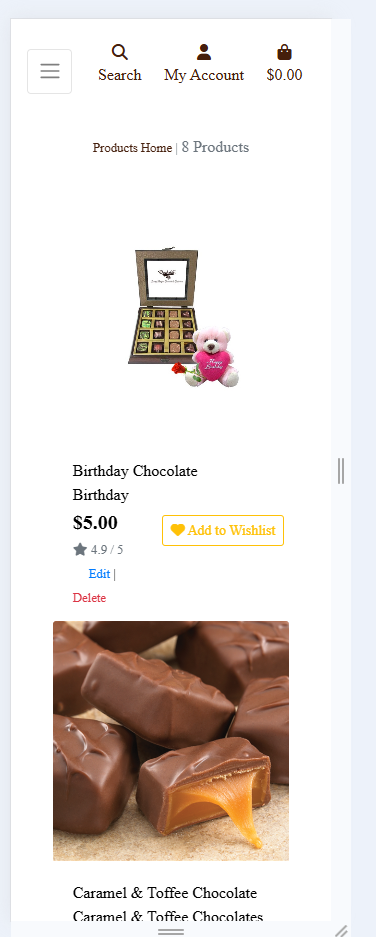

# Documented Manual Testing for | Sweet Bite (E-commerce Application)

Throughout the development of this project, testing was conducted continuously to ensure that each user story and feature was designed and implemented as intended. During the coding phase, regular testing was performed to confirm the functionality and design met expectations. The project was also frequently tested using Google Chrome Dev Tools to identify any display or terminal issues.

Below, you will find the documentation for User Story Testing, along with details of other manual testing processes carried out to ensure the website functions as expected.

Validation Testing
HTML Files
All HTML pages were validated using the [W3C Schools validator](https://validator.w3.org/), both in logged-in and logged-out states.

Each page was viewed through the deployed site by navigating from the homepage to other pages, then right-clicking to select 'View Page Source'. The source code was copied and directly pasted into the HTML Checker for validation.

### CSS Files

All CCS Files were tested using [W3C Schools CCS Validator](https://jigsaw.w3.org/css-validator/)

Tests came back with no errors first time.

### JavaScript Files

All additional JS files and script sections in HTML Files were tested using [JSHint](https://jshint.com/)

Any errors were fixed so all pass checks.

### Python Files

Python files were checked using the [CI PEP8 Linter](https://pep8ci.herokuapp.com/)

Most errors were due to spacing and lines to long, all of these were resolved. Below shows each app and the file tested.

# SWEET BITE - Linter Test Results

| **File Name**                                      | **Expected**                        | **Actual**                                                                                                                                 | **Result** |
| -------------------------------------------------- | ----------------------------------- | ---------------------------------------------------------------------------------------------------------------------------------------- | ----------- |
| **SWEET BITE**                                     |
| [asgi.py](http://asgi.py/)                         | CI Python Linter Shows No Errors    |                                                                                                                                           | Pass        |
| [settings.py](http://settings.py/)                 | CI Python Linter Shows No Errors    | Some lines were too long but could not alter due to setup.  41: E501 line too long (80 > 79 characters)  48: E501 line too long (80 > 79 characters)  164: E501 line too long (91 > 79 characters)  167: E501 line too long (81 > 79 characters)  170: E501 line too long (82 > 79 characters)  173: E501 line too long (83 > 79 characters) |             |
| [urls.py](http://urls.py/)                         | CI Python Linter Shows No Errors    | CI Python Linter Shows No Errors                                                                                                            | Pass        |
| [views.py](http://views.py/)                       | CI Python Linter Shows No Errors    | CI Python Linter Shows No Errors                                                                                                            | Pass        |
| [wsgi.py](http://wsgi.py/)                         | CI Python Linter Shows No Errors    | CI Python Linter Shows No Errors                                                                                                            | Pass        |
| **BAG**                                           |
| [apps.py](http://apps.py/)                         | CI Python Linter Shows No Errors    | CI Python Linter Shows No Errors                                                                                                            | Pass        |
| [contexts.py](http://contexts.py/)                 | CI Python Linter Shows No Errors    | CI Python Linter Shows No Errors                                                                                                            | Pass        |
| [urls.py](http://urls.py/)                         | CI Python Linter Shows No Errors    | CI Python Linter Shows No Errors                                                                                                            | Pass        |
| [views.py](http://views.py/)                       | CI Python Linter Shows No Errors    | CI Python Linter Shows No Errors                                                                                                            | Pass        |
| **CHECKOUT**                                       |
| [admin.py](http://admin.py/)                       | CI Python Linter Shows No Errors    | CI Python Linter Shows No Errors                                                                                                            | Pass        |
| [apps.py](http://apps.py/)                         | CI Python Linter Shows No Errors    | CI Python Linter Shows No Errors                                                                                                            | Pass        |
| [forms.py](http://forms.py/)                       | CI Python Linter Shows No Errors    | CI Python Linter Shows No Errors                                                                                                            | Pass        |
| [models.py](http://models.py/)                     | CI Python Linter Shows No Errors    | CI Python Linter Shows No Errors                                                                                                            | Pass        |
| [signals.py](http://signals.py/)                   | CI Python Linter Shows No Errors    | CI Python Linter Shows No Errors                                                                                                            | Pass        |
| [urls.py](http://urls.py/)                         | CI Python Linter Shows No Errors    | CI Python Linter Shows No Errors                                                                                                            | Pass        |
| [webhook-handler.py](http://webhook-handler.py/)   | CI Python Linter Shows No Errors    | CI Python Linter Shows No Errors                                                                                                            | Pass        |
| [webhooks.py](http://webhooks.py/)                 | CI Python Linter Shows No Errors    | CI Python Linter Shows No Errors                                                                                                            | Pass        |
| [views.py](http://views.py/)                       | CI Python Linter Shows No Errors    | CI Python Linter Shows No Errors                                                                                                            | Pass        |
| **PRODUCTS**                                       |
| [admin.py](http://admin.py/)                       | CI Python Linter Shows No Errors    | CI Python Linter Shows No Errors                                                                                                            | Pass        |
| [apps.py](http://apps.py/)                         | CI Python Linter Shows No Errors    | CI Python Linter Shows No Errors                                                                                                            | Pass        |
| [forms.py](http://forms.py/)                       | CI Python Linter Shows No Errors    | CI Python Linter Shows No Errors                                                                                                            | Pass        |
| [models.py](http://models.py/)                     | CI Python Linter Shows No Errors    | CI Python Linter Shows No Errors                                                                                                            | Pass        |
| [urls.py](http://urls.py/)                         | CI Python Linter Shows No Errors    | CI Python Linter Shows No Errors                                                                                                            | Pass        |
| [views.py](http://views.py/)                       | CI Python Linter Shows No Errors    | CI Python Linter Shows No Errors                                                                                                            | Pass        |
| [widgets.py](http://widgets.py/)                   | CI Python Linter Shows No Errors    | CI Python Linter Shows No Errors                                                                                                            | Pass        |
| **PROFILES**                                       |
| [apps.py](http://apps.py/)                         | CI Python Linter Shows No Errors    | CI Python Linter Shows No Errors                                                                                                            | Pass        |
| [forms.py](http://forms.py/)                       | CI Python Linter Shows No Errors    | CI Python Linter Shows No Errors                                                                                                            | Pass        |
| [models.py](http://models.py/)                     | CI Python Linter Shows No Errors    | CI Python Linter Shows No Errors                                                                                                            | Pass        |
| [urls.py](http://urls.py/)                         | CI Python Linter Shows No Errors    | CI Python Linter Shows No Errors                                                                                                            | Pass        |
| [views.py](http://views.py/)                       | CI Python Linter Shows No Errors    | CI Python Linter Shows No Errors                                                                                                            | Pass        |
 **WISHLIST**                                       |
| [admin.py](http://admin.py/)                       | CI Python Linter Shows No Errors    | CI Python Linter Shows No Errors                                                                                                            | Pass        |
| [apps.py](http://apps.py/)                         | CI Python Linter Shows No Errors    | CI Python Linter Shows No Errors                                                                                                            | Pass        |
| [forms.py](http://forms.py/)                       | CI Python Linter Shows No Errors    | CI Python Linter Shows No Errors                                                                                                            | Pass        |
| [models.py](http://models.py/)                     | CI Python Linter Shows No Errors    | CI Python Linter Shows No Errors                                                                                                            | Pass        |
| [urls.py](http://urls.py/)                         | CI Python Linter Shows No Errors    | CI Python Linter Shows No Errors                                                                                                            | Pass        |
| [views.py](http://views.py/)                       | CI Python Linter Shows No Errors    | CI Python Linter Shows No Errors                                                                                                            | Pass        |

# User Story Testing Results

| **User Story**                                       | **Test**                               | **Action**                                 | **Expected**                                                | **Result** |
| --------------------------------------------------- | -------------------------------------- | ------------------------------------------ | ----------------------------------------------------------- | ---------- |
| **Email Notification After Order**                  | Test Email Notification after Order    | Place an order and verify email sent       | Email is sent successfully after order placement              | Pass       |
| **Deploy the application on Heroku for a live production environment** | Test Deployment on Heroku              | Deploy app on Heroku and check status      | App is successfully deployed on Heroku                       | Pass       |
| **Configure AWS for Image Hosting**                 | Test AWS Configuration for Images      | Configure AWS and upload an image          | Image is uploaded and hosted on AWS successfully             | Pass       |
| **View Reviews**                                     | Test Review Viewing                    | View product reviews                       | Reviews are visible for the products                        | Pass       |
| **Write a Review**                                   | Test Writing Reviews                   | Write a review for a product               | Review is successfully posted and visible                    | Pass       |
| **Remove Items from Wishlist**                      | Test Removing Items from Wishlist      | Remove an item from the wishlist           | Item is removed from wishlist                                | Pass       |
| **View Wishlist**                                    | Test Viewing Wishlist                  | View the wishlist                          | Wishlist displays all saved items                             | Pass       |
| **Filtering and Sorting Products**                   | Test Filtering and Sorting Products    | Apply filters and sort products            | Products are filtered and sorted according to selection      | Pass       |
| **Promotional Offers and Discounts**                | Test Promotional Offers                | Apply a discount code during checkout      | Discount is successfully applied to the total                | Pass       |
| **Wishlist/Save Products**                           | Test Saving Products to Wishlist       | Add products to the wishlist               | Products are added to wishlist                               | Pass       |
| **Admin Management (for Store Owners/Admins)**      | Test Admin Dashboard                   | Access Admin Dashboard and manage products | Admin dashboard is accessible and products can be managed    | Pass       |
| **Managing User Profile**                           | Test User Profile Management           | Edit user profile details                  | User profile is updated successfully                         | Pass       |
| **Order History and Tracking**                      | Test Order History and Tracking        | View order history and track order status  | Order history and tracking information are displayed         | Pass       |
| **Order Confirmation & Payment**                    | Test Order Confirmation and Payment    | Complete an order and verify confirmation   | Order is confirmed and payment processed successfully        | Pass       |
| **Checkout Process**                                | Test Checkout Process                  | Complete the checkout process              | Checkout process is completed successfully                   | Pass       |
| **Managing Shopping Cart**                          | Test Shopping Cart Management          | Add, remove, and update items in the cart  | Items are added/removed/updated successfully in the cart     | Pass       |
| **Search Functionality**                            | Test Product Search                    | Use the search bar to find a product       | Relevant products are displayed based on search query       | Pass       |
| **Adding Products to Cart**                         | Test Adding Products to Cart           | Add products to the shopping cart          | Products are successfully added to the shopping cart         | Pass       |
| **Viewing Product Details**                         | Test Product Detail View               | View product details page                 | Product details page displays correct information            | Pass       |
| **Browsing Products**                               | Test Product Browsing                  | Browse through product catalog             | Products are browsable and categories are visible            | Pass       |
| **Managing User Profile**                           | Test Managing User Profile             | Update user profile information            | User profile is successfully updated                         | Pass       |
| **User Login & Logout**                             | Test User Login and Logout             | Log in and log out of user account         | User is able to log in and log out successfully              | Pass       |
| **User Registration & Authentication**              | Test User Registration and Authentication | Register a new user and authenticate      | New user is successfully registered and authenticated       | Pass       |

# Additional Testing

The website was tested on an iPhone 13 Pro to verify the accuracy of Chrome DevTools' responsiveness settings and to ensure smooth navigation across all pages on mobile devices.

Each link and button has been thoroughly tested to guarantee that users can easily navigate the site as intended.

Toast notifications were checked to confirm they appear when users complete actions that trigger system alerts.

For security testing, we ensured that users without proper authorization (e.g., no account, no content ownership, or no admin access) are unable to access restricted pages through direct URL entry. Additionally, a custom 403 error page was implemented to improve the user experience in such cases.

# Responsiveness

Throughout the development of the site, the Chrome DevTools responsive design feature was used to ensure a mobile-first approach. The website is fully functional across various devices, including mobiles, tablets, and larger laptop screens.

Mobile and tablet views:

Home page mobile view

Home page tablet view

Mobile Products 

Tablet Product View 

# Bugs/Issues

During testing with WAVE, two contrast issues were flagged, but I was unable to identify their exact locations, so I was unable to resolve them.

All other bugs and issues discovered during manual testing were addressed and corrected in the code to prevent them from recurring.

